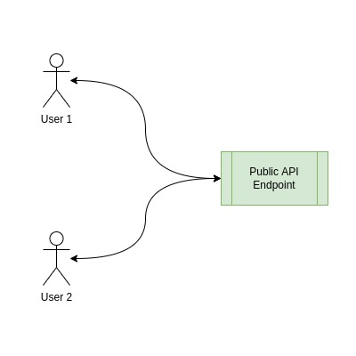
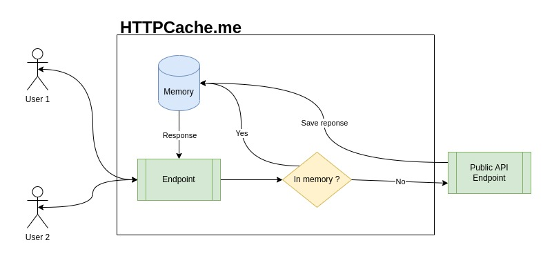

# httpcache
> 💾 Cache HTTP request easily from public API - https://httpcache.me
# Goal
With httpcache.me, you can cache http request from public API,
it can be very useful if you want to use a public API on a static site for example,
no need to develop and deploy an http proxy to override the rate limits.
# Usage
For use it, you just need to add `https://httpcache.me/{exp_in_minute}/` before the endpoint,
that it, you can check below an example for cache a request on Github API for get last repos from the user ermos :
```shell
https://httpcache.me/1280/https://api.github.com/users/ermos/repos?sort=created&per_page=4&page=1&desc
```
# Use case
## Cache request across users
### Without HTTPCache.me
<p align="center"></p>

When you use a public API directly in your website,
the request is made from the user client, if the public API send cache header,
the user client will save it. But now, if a second user client come on your website,
he send a new request and store it into his client. Each request need some working server side and can cost time.
### With HTTPCache.me
<p align="center"></p>

When a user come to your website, the request is made from the user client, httpcache will save the result in memories and when
the second user come on your website, the result is directly returned without asking the public API.
